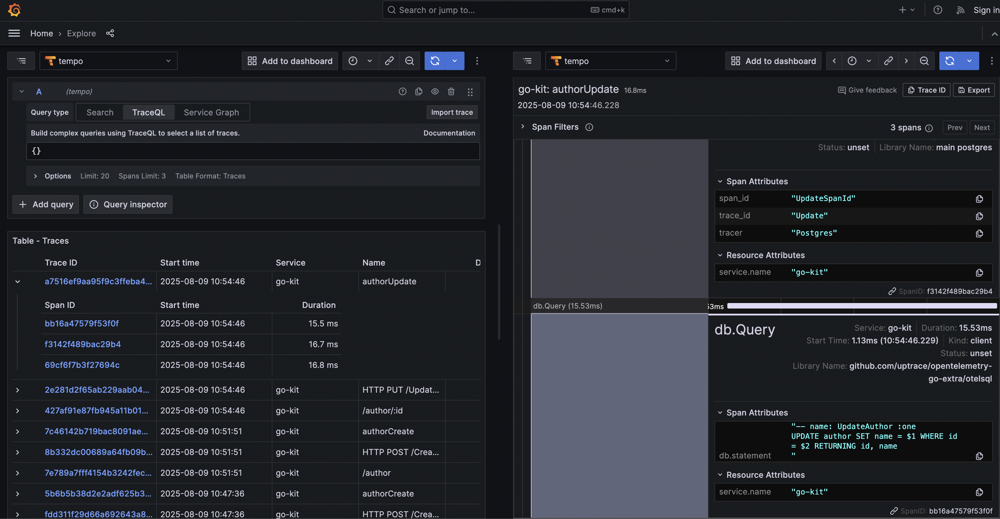

## Golang kit

# install (https://taskfile.dev)

```bash
    task otelwrapper # generate otel weapper tracer
    task sqlc # sqlc generate
    task down # remove container with volumens
    task up # renning docker
```

